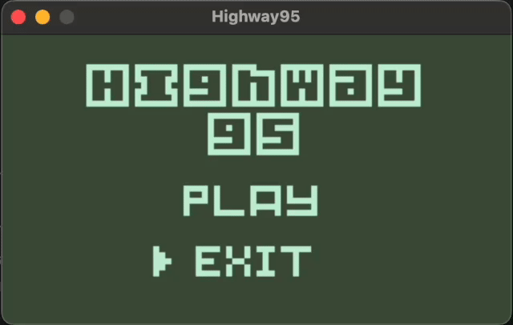

<p align="center">
  
</p>

# 🚗 Highway95  

**Highway95** is a retro game, where you have to avoid cars from highway !

## 🎨 Preview

<p align="center">
  
</p>

## 🎮 How to play

- Use `↑` to move up
- Use `↓` to move down
- Use `ESC` to pause the game

## 🚀 Technologies

- [SDL2](https://www.libsdl.org/)
- [SDL2_mixer](https://www.libsdl.org/projects/SDL_mixer/)
- [SDL2_ttf](https://www.libsdl.org/projects/SDL_ttf/)

## 🛠️  Technical considerations

- The game was developed to follow the **Nokia 3310** capabilities.
- The game was created to follow much as possible the **42 norm**.

## 📦 Compilation

Just run the following command:
```bash
make
```

This will generate a `Highway95` executable file.
Some dependencies can not be found, update the `Makefile` with the correct path of the dependencies.

## 📝 License

This project is under the MIT license. See the [LICENSE](LICENSE) for more information.